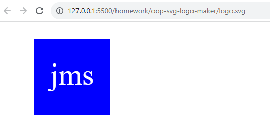

# Object-Oriented Programming SVG Logo Maker

## Description/What I attempted to do

Create an application that generates an .svg file based on user input. The final product is a log that includes a shape, shape color, text and text color selected by the user. The application is run by entering the comman "node index.js" into the terminal. I built this to easily generate simple logos on my own. As part of this project, I learned how to use classes as part of the code to generate an .svg logo. I also learned how to write and run tests on my code.

## Table of Contents

### [Usage](#usage)

### [License](#license)

### [Contributing](#contributing)

### [Tests](#tests)

### [Questions](#questions)

## Usage

Open the terminal while in the index.js file of the oop-svg-logo-maker folder and enter "node index.js" into the terminal. Answer the questions that appear in the terminal to generate a logo. Open the logo.svg file in the server to see the logo you created. This project uses the Inquirer and Jest packages.

## License

The license for this project is MIT and the link for license information is https://opensource.org/licenses/MIT.

## Contributing/Acknowledgements

Tips from University of Minnesota Full Stack Bootcamp instructor Gary Almes and notes from class sessions.

Tips from tutoring session with Alexis San Javier through University of Minnesota coding boot camp.

Information from Basic Shapes located here: https://developer.mozilla.org/en-US/docs/Web/SVG/Tutorial/Basic_Shapes

Information from Polygon located here: https://developer.mozilla.org/en-US/docs/Web/SVG/Tutorial/Basic_Shapes#polygon

## Tests

Enter "npm run test" in the terminal to run tests for the circle, square and triangle classes.

## Questions

Please find more information at my GitHub, located [here](https://github.com/Jacqueline-Stiehl).
If you have additional questions, please contact me at salsajackie@yahoo.com.

## Screen shot

## Link to the working version of the code

https://github.com/Jacqueline-Stiehl/oop-svg-logo-maker-jstiehl

## Link to walkthrough video

https://watch.screencastify.com/v/QZ3XreFsqlpEyi5ixMbU
